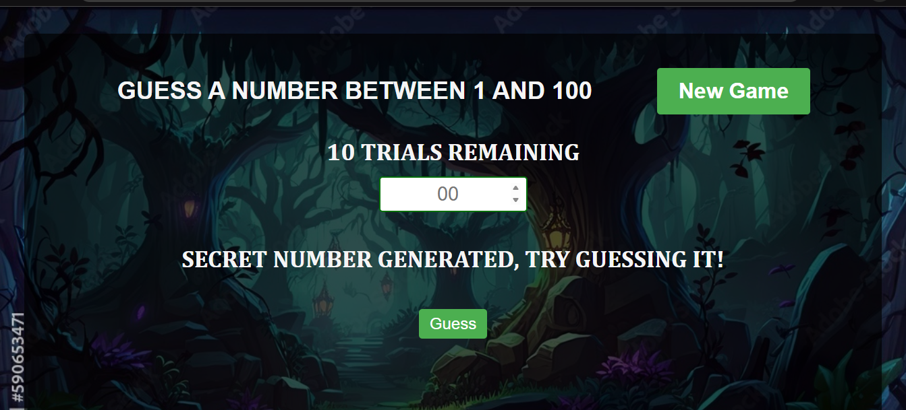

<<<<<<< HEAD
# 🔢 Number Guessing Game

This is a simple React-based Number Guessing Game where players attempt to guess a randomly generated number between 1 and 100. The game gives users 10 trials and offers real-time feedback after each guess.

## 🎮 Gameplay Features

- Random number generation between 1 and 100
- 10 trials per game
- Real-time feedback ("Too high", "Too low", "Correct")
- Input disabled after winning or losing
- Option to start a new game
- State managed entirely using `useReducer` (no `useState` used)

## 🚀 Tech Stack

- React (with `useReducer` for state management)
- Vite (for fast React development)
- CSS (for basic styling)

## 🧠 What I Learned

- Advanced state management using `useReducer`
- Clean separation of logic and UI
- Building responsive and interactive React components

## 📦 Getting Started

```bash
# Clone the repository
git clone https://github.com/yourusername/number-guessing-game.git

# Navigate into the project directory
cd number-guessing-game

# Install dependencies
npm install

# Run the app
npm run dev
```

📸 Screenshots



📜 License
This project is licensed under the MIT License.
=======
